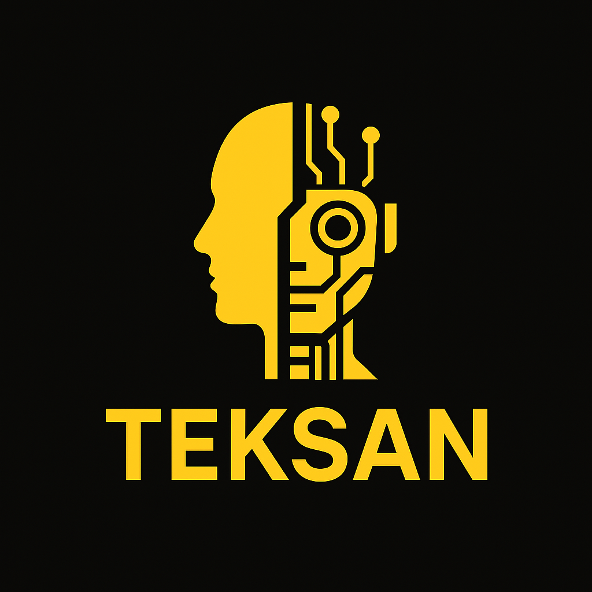

<<<<<<< HEAD
# TekSan 🤖

<div align="center" dir="rtl">
  
</div>

<div align="right" dir="rtl">

**یک چت بات هوش مصنوعی کاملا فارسی** 🌟

---

### نمایه کلی:
پروژه **TekSan** با استفاده از API به مدل‌های گوگل (همچنین چندین مدل دیگر که در آینده اضافه خواهند شد 🎉) دسترسی دارد. در این برنامه، کاربر می‌تواند در یک محیط **گرافیکی (GUI)** با انواع هوش مصنوعی و قابلیت‌های متنوع (به‌زودی) تعامل داشته باشد.

### ویژگی‌ها:
1. 🔹 **اولین چت بات هوش مصنوعی کاملا فارسی**
2. 🔹 **عدم نیاز به استفاده از فیلترشکن** و برنامه‌های اضافی برای تعامل با هوش مصنوعی
3. 🔹 **استفاده به صورت ناشناس و خصوصی**

### هدف تولید:
هدف اصلی ساخت این پروژه صرفاً ایجاد یک چت ساده هوش مصنوعی نیست؛ بلکه قصد ما گردآوری قابلیت‌های کمتر شناخته‌شده هوش مصنوعی (مانند تحلیل ویدیو، گفتگوی صوتی، تحلیل تصاویر و ...) در یک برنامه به زبان فارسی روان است. این پروژه بدون نیاز به صرف زمان برای روشن کردن فیلترشکن یا ثبت‌نام در سایت‌های مختلف آماده استفاده می‌باشد. 🚀

همچنین، یکی از اهداف مهم ما کمک به افراد نابینا است. تصور کنید که یک فرد نابینا بتواند موبایل خود را در جلوی خود قرار داده، و هوش مصنوعی فریم‌های تصویر را تحلیل کند و به صورت صوتی اطلاعات مفید ارائه دهد. (البته افزودن این قابلیت از اهداف بلندمدت پروژه است؛ زیرا ابتدا باید نسخه اندروید ساخته شود) 💡

---

### پیکربندی و استفاده از کدها:
</div>

1. ابتدا یک **APIKey** از طریق [این لینک](https://aistudio.google.com/apikey) دریافت کنید و آن را در فایل **.env** جایگزین **"your Gemini API Key"** نمایید.
2. (اختیاری) ایجاد یک محیط مجازی برای اجرای پروژه:

```bash
python -m venv venv
```

3. فعال‌سازی محیط مجازی:

```bash
Path-Project\venv\Scripts\activate
```

4. نصب کتابخانه‌های مورد نیاز:

```bash
pip install -r requirements.txt
```

5. حالا می‌توانید فایل **main.py** را اجرا کرده و از پروژه بهره ببرید.

---

<div align="right" dir="rtl">

### سخن آخر:
خواهشمندیم برای صورت حمایت از پروژه، آن را به دیگران معرفی کنید و نظرات یا پیشنهادات خود را از طریق ایمیل به **ad132546798110@gmail.com** ارسال نمایید. همچنین، اگر مایل به حمایت مالی هستید، لطفاً از طریق شماره کارت **5892101408310205** ما را در تسریع توسعه پروژه یاری کنید. 🙏💖

</div>
=======
# Teksan
a Ai chatbot with gemenai
>>>>>>> 466e1f05f9bf5d0186dc601cfbdf53123019b415
